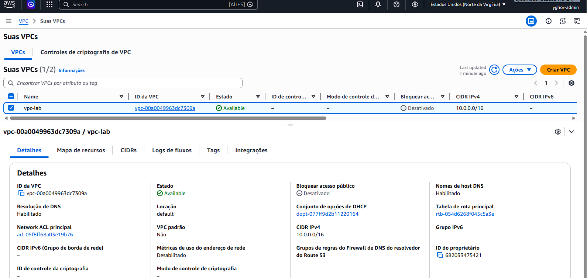
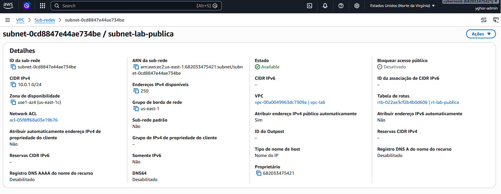
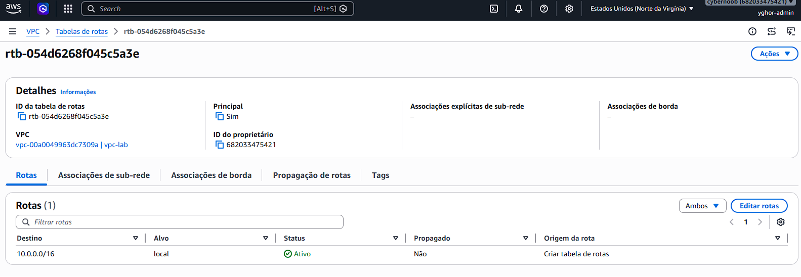
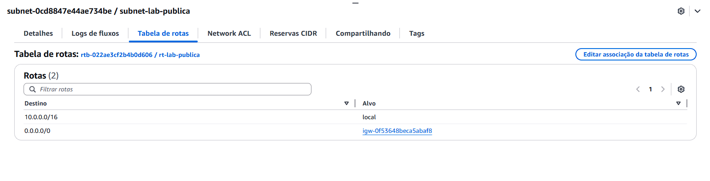
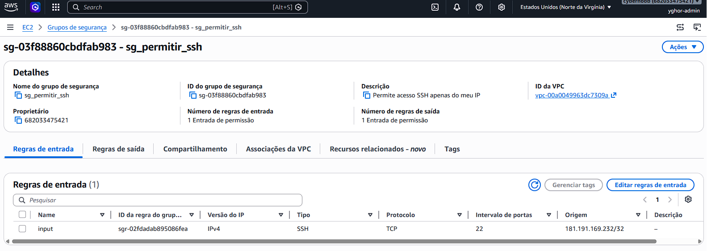
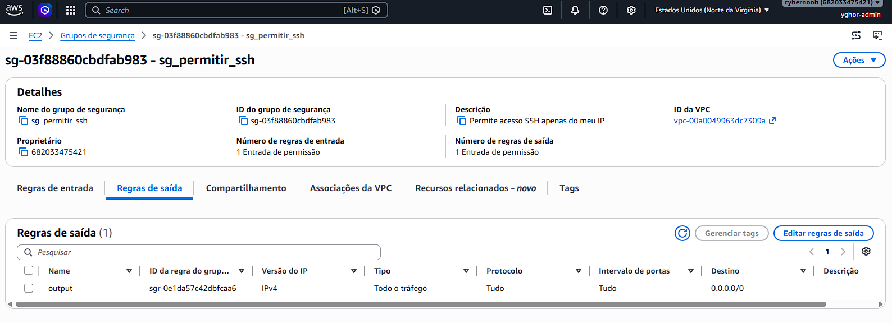
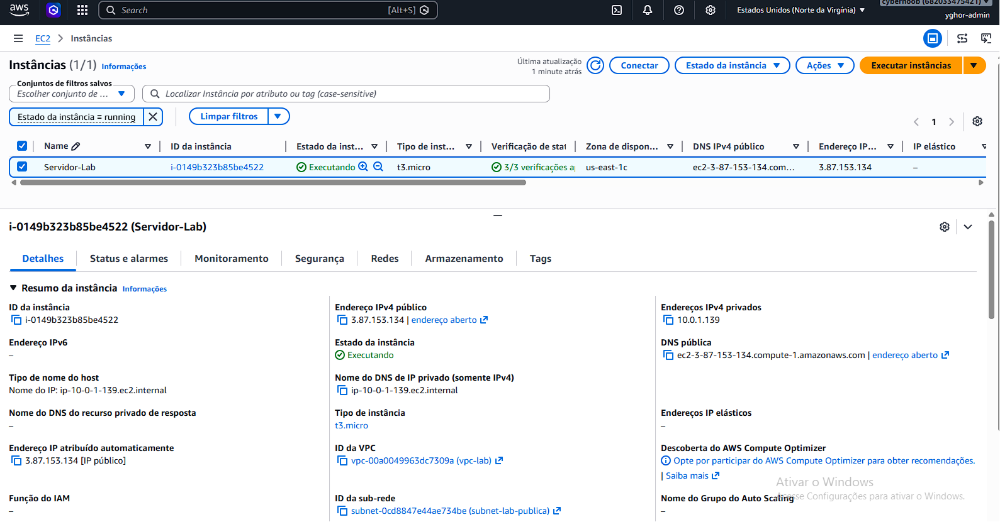
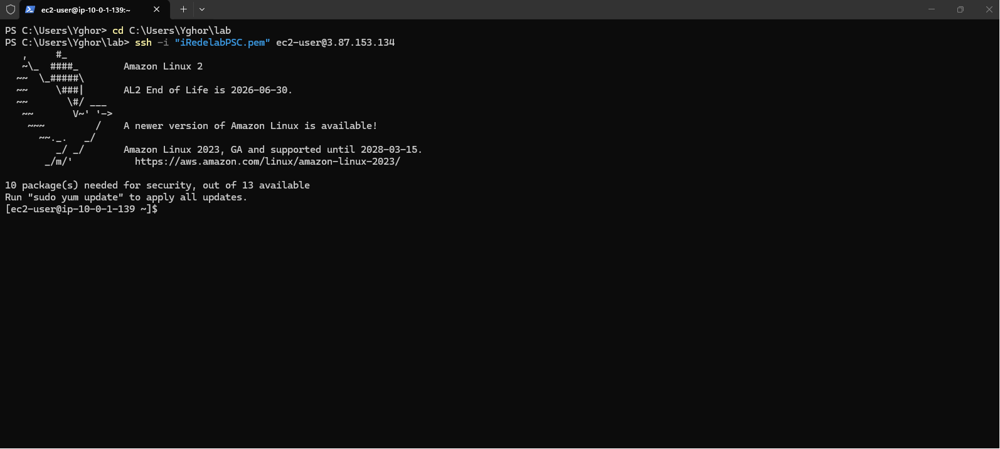

# 🌐 Provisionamento de Infraestrutura Isolada na AWS com Terraform

Este repositório contém a entrega da atividade prática do módulo intermediário do **Curso Provisionamento de Serviços Computacionais (PSC)** ofertado pelo **iRede** através do programa **Capacita iRede**. 
O objetivo deste projeto é demonstrar o provisionamento automatizado de uma infraestrutura de rede e computação isolada na AWS utilizando **Infraestrutura como Código (IaC)** com Terraform, estabelecendo um paralelo direto com o Console Web da AWS.

---

## 🗺️ Parábola de Arquitetura: Código vs. Console AWS

Abaixo está a justificativa técnica e o papel de cada recurso criado na arquitetura para permitir o acesso seguro ao servidor:

### 1. Virtual Private Cloud (VPC)
* **No Código (`aws_vpc`):** Define um bloco CIDR `10.0.0.0/16` denominado `vpc-lab` Conforme solicitado na ativdade.
* **No Console AWS:** Funciona como uma cerca digital isolada na nuvem. Ela garante que nenhuma máquina externa ou de outra conta acesse os recursos sem que rotas explícitas sejam criadas.

### 2. Sub-rede Pública (Subnet)
* **No Código (`aws_subnet`):** Define o escopo `10.0.1.0/24`. A propriedade `map_public_ip_on_launch = true` força a alocação automatizada de IPs públicos.
* **No Console:** É a segmentação interna da nossa rede. No painel de Subnets, equivale a marcar a caixa de seleção que ativa a atribuição de IP público no lançamento de qualquer recurso ali hospedado.

### 3. Internet Gateway (IGW)
* **No Código (`aws_internet_gateway`):** Cria e vincula o componente de borda diretamente à ID da nossa VPC.
* **No Console:** Representa a "porta da rua" da rede corporativa. Sem este componente acoplado à VPC, a sub-rede permanece privada e sem qualquer comunicação bidirecional com a internet externa.

### 4. Tabela de Rotas e Associação (Route Table)
* **No Código (`aws_route_table` & `aws_route_table_association`):** Mapeia a rota destino `0.0.0.0/0` (toda a internet) apontando para o ID do Internet Gateway.
* **No Console:** Atua como o guarda de trânsito da rede. Ela direciona ativamente os pacotes que saem da sub-rede pública em direção à rede mundial de computadores através do IGW.

### 5. Security Group (Firewall)
* **No Código (`aws_security_group`):** Abre a porta de entrada `22 (TCP/SSH)` aplicando o princípio do privilégio mínimo ao restringir o acesso apenas para o IP do administrador com o sufixo `/32`.
* **No Console:** Funciona como o vigilante na porta do servidor (nível de instância). Ele inspeciona cada pacote de dados e só permite que conexões SSH originadas do IP configurado cheguem até o sistema operacional.

### 6. Instância EC2 (Computação)
* **No Código (`aws_instance`):** Instancia uma máquina virtual de tamanho `t3.micro` utilizando a AMI **Amazon Linux 2**.
* **No Console:** Trata-se do servidor virtualizado (hardware e sistema operacional) que executará as aplicações do laboratório.
 
**Nota:** Durante a atividade foi verificado que a instância `t2.micro` não faz mais parte do Free Tier, segui atualizado para a geração mais próxima que é comtemplada pelo Free Tier, no caso a `t3.micro`.
---

## 📸 Evidências do Provisionamento


### 1. VPC Criada


### 2. Sub-rede Pública Configurada


### 3. Tabela de Rotas Associada



### 4. Security Group (Porta 22)



### 5. Instância EC2 em Execução


### 6. Acesso SSH Efetuado com Sucesso via Terminal.👨🏽‍💻



## 🛠️ Como Executar este Projeto Localmente

1. Certifique-se de ter o **AWS CLI** e o **Terraform** instalados.
2. Autentique-se na sua conta através do terminal:
   ```bash
   aws configure